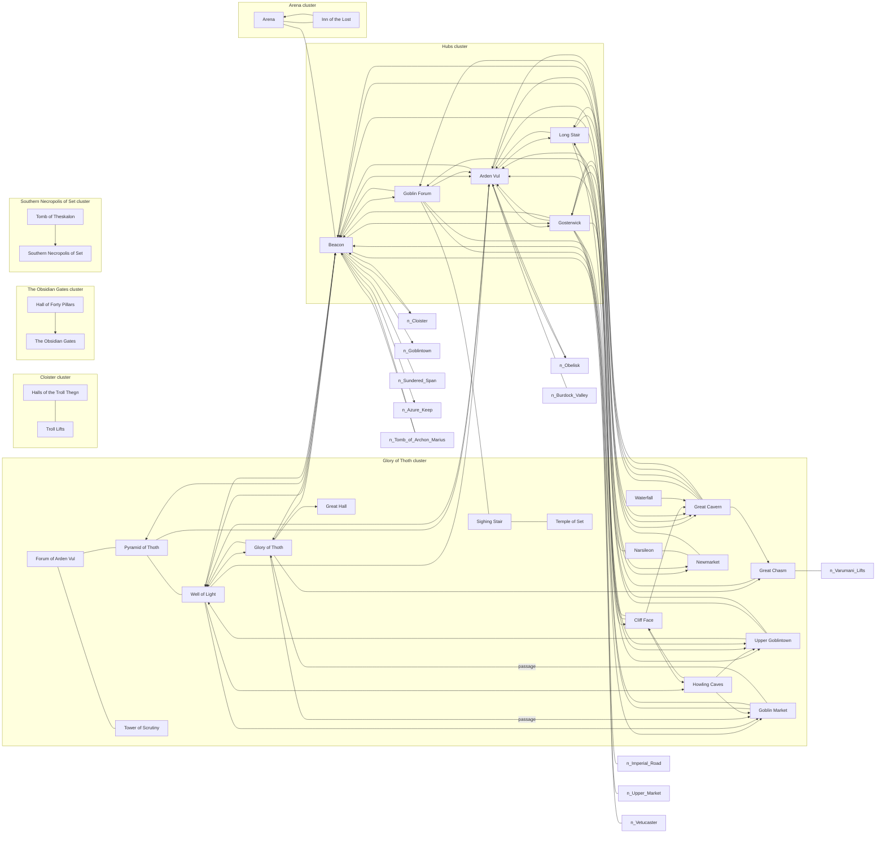

---
tags:
  - note
  - map
generated_by: scripts/location_graph.py
---

# Location Map

Auto-generated adjacency map of Arden Vul locations, clustered by graph community. Only **confirmed** edges (explicit connection, ≥2 independent signals, or LLM-cited) are drawn. Edge labels show inferred type/direction where known. This is inferred from text and may contain errors.

