---
tags:
  - note
  - map
generated_by: scripts/location_graph.py
---

# Location Map

Auto-generated adjacency map of Arden Vul locations, clustered by graph community. Only **confirmed** edges are drawn: a curated typed edge (`config/location_edges_seed.json`), an explicit page connection, or one backed by ≥2 independent signals. Travel/staging artifacts (e.g. teleporting from the Beacon base) are suppressed. Edge labels show the connection type. Inferred from canon + Vallium's route plans; may contain errors.

```mermaid
flowchart LR
  subgraph c_n_Thothian_Teleportation_Network["Thothian Teleportation Network cluster"]
    n_Archon_s_Palace["Archon's Palace"]
    n_Thothian_Teleportation_Network["Thothian Teleportation Network"]
    n_Citadel_Donjon_Cellar["Citadel Donjon Cellar"]
    n_Thothian_Administration_Building_Cellar["Thothian Administration Building Cellar"]
    n_Hall_of_Seeing["Hall of Seeing"]
    n_Summoning_Chamber["Summoning Chamber"]
    n_Halls_of_Thoth["Halls of Thoth"]
    n_Bridge_of_Set["Bridge of Set"]
    n_Ancient_Hall_of_Set["Ancient Hall of Set"]
    n_Sanctum_of_Thoth["Sanctum of Thoth"]
    n_Coliseum["Coliseum"]
    n_The_Lady_s_Asylum["The Lady's Asylum"]
    n_Deep_Shrine_of_Thoth["Deep Shrine of Thoth"]
    n_Chamber_of_Several_Uses["Chamber of Several Uses"]
    n_Archontean_Pediment["Archontean Pediment"]
    n_Hall_of_Shrines["Hall of Shrines"]
    n_Hall_of_Servants["Hall of Servants"]
    n_Archontean_Parvis["Archontean Parvis"]
    n_Canyon_Vaults["Canyon Vaults"]
  end
  subgraph c_n_Forum_of_Set["Forum of Set cluster"]
    n_Forum_of_Set["Forum of Set"]
    n_Temple_of_Set["Temple of Set"]
    n_Red_Bridge_of_Set["Red Bridge of Set"]
    n_Upper_Goblintown["Upper Goblintown"]
    n_Goblin_Market["Goblin Market"]
    n_Goblin_Great_Hall["Goblin Great Hall"]
    n_Goblin_Warrens["Goblin Warrens"]
    n_Sighing_Stair["Sighing Stair"]
  end
  subgraph c_n_Pyramid_of_Thoth["Pyramid of Thoth cluster"]
    n_Forum_of_Arden_Vul["Forum of Arden Vul"]
    n_Pyramid_of_Thoth["Pyramid of Thoth"]
    n_Tower_of_Scrutiny["Tower of Scrutiny"]
    n_Hall_of_Heroes["Hall of Heroes"]
    n_Square_Tower_East_of_Forum["Square Tower (East of Forum)"]
  end
  subgraph c_n_Great_Cavern["Great Cavern cluster"]
    n_Haunted_Tower["Haunted Tower"]
    n_Waterfall["Waterfall"]
    n_Great_Cavern["Great Cavern"]
    n_Great_Chasm["Great Chasm"]
    n_Chasm_Floor["Chasm Floor"]
  end
  subgraph c_n_Cliff_Face["Cliff Face cluster"]
    n_Baboon_Cave["Baboon Cave"]
    n_Howling_Caves["Howling Caves"]
    n_Cave_with_Spider_Webs["Cave with Spider Webs"]
    n_Cliff_Face["Cliff Face"]
  end
  subgraph c_n_Newmarket["Newmarket cluster"]
    n_Narsileon["Narsileon"]
    n_Newmarket["Newmarket"]
  end
  subgraph c_n_Beacon["Beacon cluster"]
    n_Beacon["Beacon"]
    n_Cloister["Cloister"]
    n_Behir_Caves["Behir Caves"]
    n_Rudishva_Bastion["Rudishva Bastion"]
    n_Tomb_of_Archon_Marius["Tomb of Archon Marius"]
  end
  subgraph c_n_Hubs["Hubs cluster"]
    n_Arden_Vul["Arden Vul"]
    n_Long_Stair["Long Stair"]
    n_Gosterwick["Gosterwick"]
    n_Glory_of_Thoth["Glory of Thoth"]
    n_Well_of_Light["Well of Light"]
  end
  subgraph c_n_The_Obsidian_Gates["The Obsidian Gates cluster"]
    n_Hall_of_Forty_Pillars["Hall of Forty Pillars"]
    n_The_Obsidian_Gates["The Obsidian Gates"]
  end
  subgraph c_n_Wet_Caves["Wet Caves cluster"]
    n_Sundered_Span["Sundered Span"]
    n_Varumani_Lifts["Varumani Lifts"]
    n_Wet_Caves["Wet Caves"]
  end
  subgraph c_n_Arena["Arena cluster"]
    n_Arena["Arena"]
    n_Inn_of_the_Lost["Inn of the Lost"]
  end
  subgraph c_n_Library_of_Thoth["Library of Thoth cluster"]
    n_Druid_s_Retreat["Druid's Retreat"]
    n_Library_of_Thoth["Library of Thoth"]
  end
  subgraph c_n_Troll_Lifts["Troll Lifts cluster"]
    n_Halls_of_the_Troll_Thegn["Halls of the Troll Thegn"]
    n_Troll_Lifts["Troll Lifts"]
  end
  subgraph c_n_Southern_Necropolis_of_Set["Southern Necropolis of Set cluster"]
    n_Southern_Necropolis_of_Set["Southern Necropolis of Set"]
    n_Tomb_of_Theskalon["Tomb of Theskalon"]
  end
  n_Arden_Vul ---|road| n_Gosterwick
  n_Arden_Vul ---|climb| n_Long_Stair
  n_Beacon ---|rug| n_Gosterwick
  n_Great_Cavern ---|passage| n_Long_Stair
  n_Glory_of_Thoth ---|passage| n_Well_of_Light
  n_Arden_Vul ---|contains| n_Pyramid_of_Thoth
  n_Beacon ---|teleporter| n_Cloister
  n_Gosterwick ---|road| n_Newmarket
  n_Cliff_Face ---|climb| n_Long_Stair
  n_Arena ---|passage| n_Inn_of_the_Lost
  n_Glory_of_Thoth ---|stairs| n_Pyramid_of_Thoth
  n_Glory_of_Thoth ---|passage| n_Goblin_Market
  n_Arden_Vul ---|climb| n_Cliff_Face
  n_Upper_Goblintown ---|passage| n_Well_of_Light
  n_Forum_of_Set ---|passage| n_Upper_Goblintown
  n_Gosterwick ---|road| n_Narsileon
  n_Forum_of_Set ---|passage| n_Temple_of_Set
  n_Forum_of_Set ---|passage| n_Goblin_Market
  n_Howling_Caves ---|passage| n_Well_of_Light
  n_Cliff_Face ---|passage| n_Howling_Caves
  n_Arden_Vul ---|contains| n_Obelisk
  n_Narsileon ---|road| n_Newmarket
  n_Sighing_Stair ---|passage| n_Temple_of_Set
  n_Halls_of_the_Troll_Thegn ---|lift| n_Troll_Lifts
  n_Glory_of_Thoth ---|passage| n_Great_Hall
  n_Great_Cavern ---|passage| n_Great_Chasm
  n_Great_Cavern ---|passage| n_Waterfall
  n_Forum_of_Arden_Vul ---|passage| n_Pyramid_of_Thoth
  n_Forum_of_Arden_Vul ---|passage| n_Tower_of_Scrutiny
  n_Forum_of_Set ---|stairs| n_Sighing_Stair
  n_Southern_Necropolis_of_Set ---|passage| n_Tomb_of_Theskalon
  n_Sundered_Span ---|lift| n_Varumani_Lifts
  n_Cliff_Face ---|passage| n_Great_Cavern
  n_Goblin_Market ---|passage| n_Well_of_Light
  n_Azure_Keep ---|contains| n_Gosterwick
  n_Burdock_Valley ---|contains| n_Gosterwick
  n_Forum_of_Set ---|passage| n_Red_Bridge_of_Set
  n_Hall_of_Forty_Pillars ---|passage| n_The_Obsidian_Gates
  n_Gosterwick ---|road| n_Imperial_Road
  n_Great_Chasm ---|lift| n_Varumani_Lifts
  n_Goblin_Market ---|passage| n_Howling_Caves
  n_Baboon_Cave ---|passage| n_Howling_Caves
  n_Baliff_s_Truncheon ---|contains| n_Gosterwick
  n_Arden_Vul ---|contains| n_Burdock_Valley
  n_Cave_with_Spider_Webs ---|passage| n_Cliff_Face
  n_Druid_s_Retreat ---|passage| n_Well_of_Light
  n_Goblin_Great_Hall ---|passage| n_Goblin_Warrens
  n_Gosterwick ---|contains| n_The_Stunned_Acolyte
  n_Haunted_Tower ---|passage| n_Waterfall
  n_Pyramid_of_Thoth ---|stairs| n_Well_of_Light
  n_Gosterwick ---|contains| n_Totey_Lake
  n_Gosterwick ---|contains| n_Upper_Market
  n_Gosterwick ---|road| n_Vetucaster
  n_Behir_Caves ---|passage| n_Cloister
  n_Cave_with_Fire_Pit ---|passage| n_Long_Stair
  n_Druid_s_Retreat ---|passage| n_Library_of_Thoth
  n_Goblin_Warrens ---|passage| n_Upper_Goblintown
  n_Forum_of_Set ---|passage| n_Goblin_Warrens
  n_Hall_of_Heroes ---|passage| n_Pyramid_of_Thoth
  n_Hall_of_Heroes ---|passage| n_Well_of_Light
  n_Gosterwick ---|contains| n_Kaelo_s_Bathhouse
  n_Library_of_Thoth ---|passage| n_Well_of_Light
  n_Sundered_Span ---|passage| n_Wet_Caves
  n_Forum_of_Set --- n_Great_Cavern
  n_Great_Chasm ---|lift| n_Troll_Lifts
  n_Arden_Vul ---|contains| n_Forum_of_Arden_Vul
  n_Forum_of_Arden_Vul ---|passage| n_Square_Tower_East_of_Forum
  n_Arena ---|lift| n_Troll_Lifts
  n_Sundered_Span ---|passage| n_Troll_Lifts
  n_Beacon ---|teleporter| n_Rudishva_Bastion
  n_Chasm_Floor ---|passage| n_Rudishva_Bastion
  n_Chasm_Floor ---|passage| n_Great_Chasm
  n_Cloister ---|passage| n_Tomb_of_Archon_Marius
  n_Great_Hall ---|passage| n_Sundered_Span
  n_Archon_s_Palace ---|teleporter| n_Thothian_Teleportation_Network
  n_Citadel_Donjon_Cellar ---|teleporter| n_Thothian_Teleportation_Network
  n_Thothian_Administration_Building_Cellar ---|teleporter| n_Thothian_Teleportation_Network
  n_Hall_of_Seeing ---|teleporter| n_Thothian_Teleportation_Network
  n_Summoning_Chamber ---|teleporter| n_Thothian_Teleportation_Network
  n_Glory_of_Thoth ---|teleporter| n_Thothian_Teleportation_Network
  n_Halls_of_Thoth ---|teleporter| n_Thothian_Teleportation_Network
  n_Bridge_of_Set ---|teleporter| n_Thothian_Teleportation_Network
  n_Ancient_Hall_of_Set ---|teleporter| n_Thothian_Teleportation_Network
  n_Hall_of_Forty_Pillars ---|teleporter| n_Thothian_Teleportation_Network
  n_Sanctum_of_Thoth ---|teleporter| n_Thothian_Teleportation_Network
  n_Coliseum ---|teleporter| n_Thothian_Teleportation_Network
  n_The_Lady_s_Asylum ---|teleporter| n_Thothian_Teleportation_Network
  n_Deep_Shrine_of_Thoth ---|teleporter| n_Thothian_Teleportation_Network
  n_Chamber_of_Several_Uses ---|teleporter| n_Thothian_Teleportation_Network
  n_Archontean_Pediment ---|teleporter| n_Thothian_Teleportation_Network
  n_Hall_of_Shrines ---|teleporter| n_Thothian_Teleportation_Network
  n_Hall_of_Servants ---|teleporter| n_Thothian_Teleportation_Network
  n_Archontean_Parvis ---|teleporter| n_Thothian_Teleportation_Network
  n_Canyon_Vaults ---|teleporter| n_Thothian_Teleportation_Network
  n_Glory_of_Thoth --- n_Goblintown
  n_Newmarket --- n_Temple_of_Thoth
  n_Glory_of_Thoth --- n_Temple_of_Thoth
  n_Great_Hall --- n_Great_Pyramid
  n_Great_Chasm --- n_Tomb_of_Archon_Marius
```

